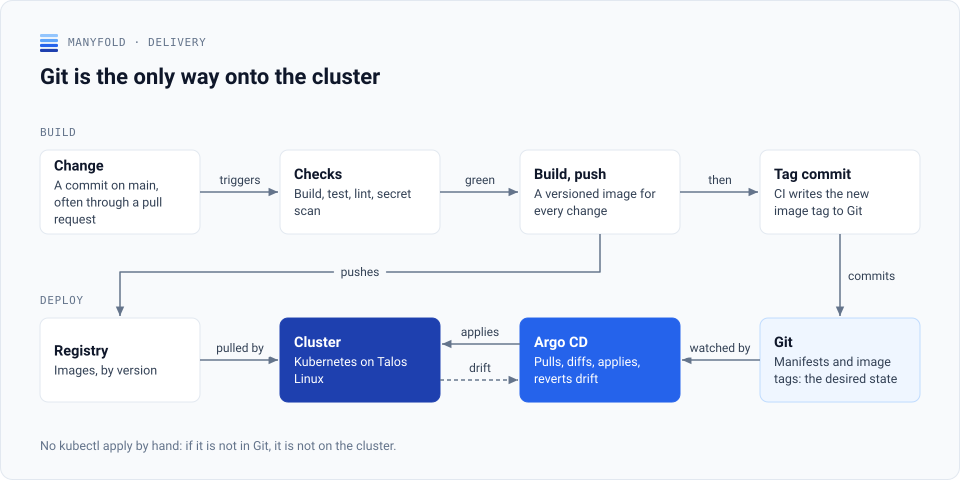
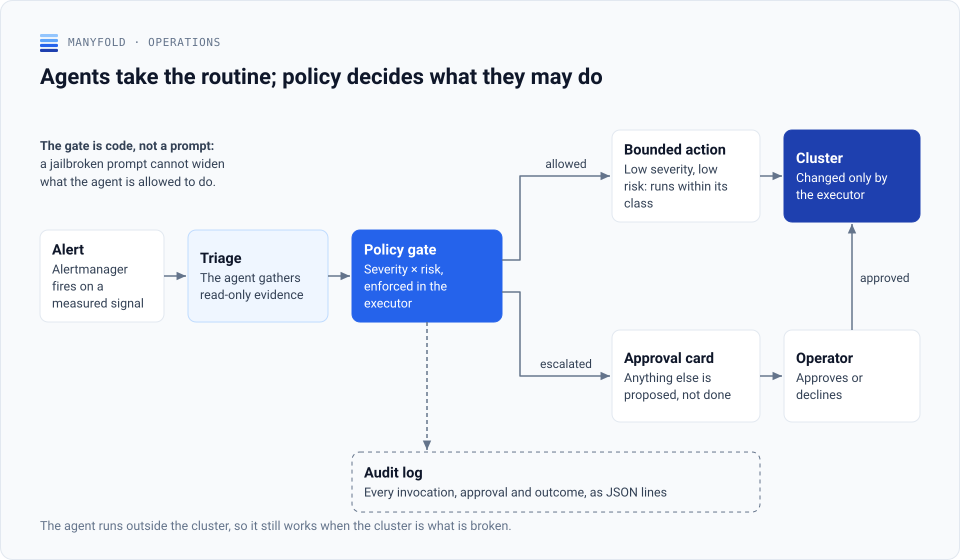
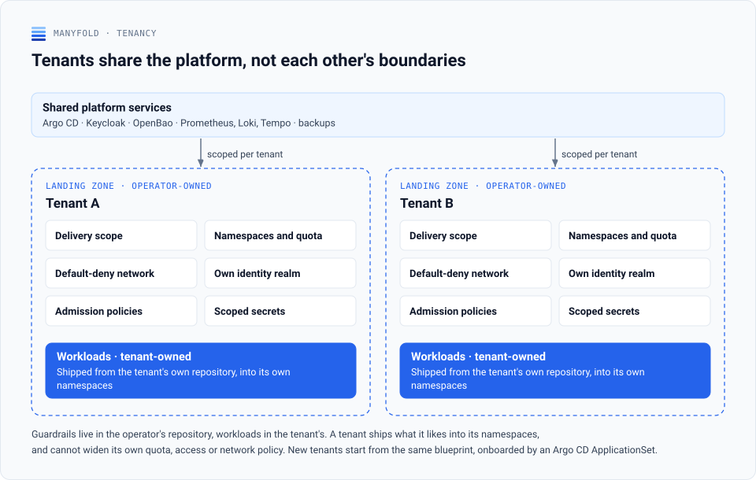
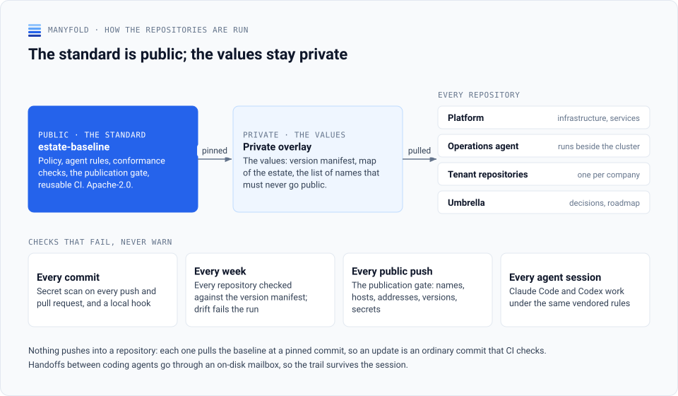

Manyfold is the platform engineering practice of [Thomas Berg von Linde](https://github.com/tbvl) in Copenhagen: consulting on Kubernetes platforms, and a small production platform run on European infrastructure for companies that want their systems looked after.

## The platform

<picture>
  <source media="(prefers-color-scheme: dark)" srcset="diagrams/platform-dark.svg">
  
</picture>

Applications and data are hosted in the EU. Everything is defined in code and delivered through Git, significant decisions are recorded as architecture decision records, and AI agents handle first-line operations around the clock.

## How it is run

**Git is the only way onto the cluster.** Every change is a commit on main, usually through a pull request. CI builds, tests and scans it for secrets, pushes a versioned image and writes the new image tag back to Git. Argo CD applies what Git says and reverts anything that drifts from it.

<picture>
  <source media="(prefers-color-scheme: dark)" srcset="diagrams/delivery-dark.svg">
  
</picture>

**Agents take the routine; policy decides what they may do.** An alert goes to an operations agent that gathers read-only evidence. Remediation runs only through executor scripts that enforce a severity × risk matrix, so a prompt cannot widen what the agent is allowed to do. Anything outside the matrix becomes an approval request. The agent runs outside the cluster, so it still works when the cluster is what is broken. The reasoning is in [decision record 0004](https://manyfold.dk/decisions/0004-single-ops-agent-with-constrained-execution).

<picture>
  <source media="(prefers-color-scheme: dark)" srcset="diagrams/operations-dark.svg">
  
</picture>

**Tenants share the platform, not each other's boundaries.** Each company gets a landing zone that the operator owns: delivery scope, namespaces and quota, a default-deny network, its own identity realm, admission policies and scoped secrets. Workloads come from the tenant's own repository, so a tenant can ship what it likes and still cannot widen its own quota, access or network policy.

<picture>
  <source media="(prefers-color-scheme: dark)" srcset="diagrams/tenancy-dark.svg">
  
</picture>

## What is public, and what is not

The repositories that hold the running configuration of the production platform and its tenants are private. Tooling that is useful outside this estate is published: [estate-baseline](https://github.com/manyfold-dk/estate-baseline) — drift checks and handoffs for a set of repositories run to one standard, by people and by coding agents (Apache-2.0). The live status, the architecture and selected decision records are at [manyfold.dk](https://manyfold.dk).

<picture>
  <source media="(prefers-color-scheme: dark)" srcset="diagrams/estate-dark.svg">
  
</picture>

## Contact

[manyfold.dk](https://manyfold.dk) · thomas@manyfold.dk
